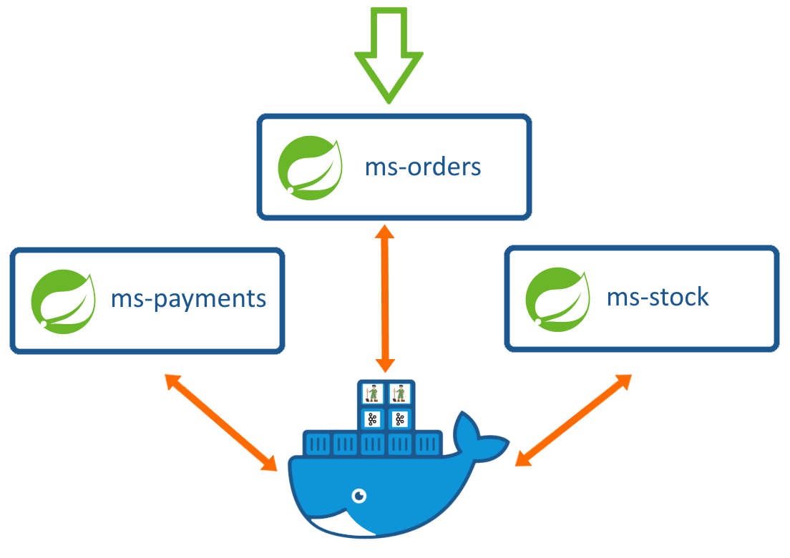

[](https://linkedin.com/in/zatribune)
## Overview
This is a Demo Project for an E-commerce Microservices Application that demonstrates Event-driven architecture using Kafka.  
<p align="center">


</p>  

## Specs  
The System consists of 3 microservices as shown in the next figure.  
-  ms-orders: a restful webservice & an orchestrator for the ordering process.  
-  ms-stock: management of product inventory.  
-  ms-payments: for payment processing.  


<p align="center">
  
</p>  

## Steps to deploy
#### Deploying Kafka + MYSQL to Docker  
First, we'll need to execute the docker compose file in order to initialize the required containers
for our environment.  
1. mysql  
2. kafka-cluster-1  
3. kafka-cluster-2  
4. zookeeper-1  
5. zookeeper-2  

run this command in the root directory
```shell
docker-compose up -d
```
The generated containers will have their name prefixed with "ecommerce". 
In order to list generated containers, run this command:
```shell
docker ps --filter "name=ecommerce"
```
Since we are going to utilize 5 Docker containers which should communicate with 
each other, we will need to start them on same network.  
By default, these containers will be mapped to a generated network named 
**ecommerce_default** with a (Bridge) driver.  
To list docker networks, run this command to validate.
```shell
docker network ls
```
You can also run this command to inspect this network.
```shell
docker network inspect ecommerce_default
```
To validate containers' ports  
```shell
docker port {container_name}
```
Next, we'll create Docker images for our 3 spring-boot apps.
```shell
docker build -t ecommerce-orders -f DockerFile .
docker build -t ecommerce-payments -f DockerFile .
docker build -t ecommerce-stock -f DockerFile .
```
Finally, you can run those images locally (**ms-orders** is exposed to port 9091).  
Alternately, you can use those images with **Kubernetes**.  

## Built With  
&nbsp;&nbsp;&nbsp;&nbsp;**Java (JDK 11)** - The Main Programming Language and Framework.  
&nbsp;&nbsp;&nbsp;&nbsp;**Spring Boot** - Software Platform for creating and delivering Web Applications.  
&nbsp;&nbsp;&nbsp;&nbsp;**Apache Kafka** - distributed data streaming platform.  
&nbsp;&nbsp;&nbsp;&nbsp;**MySQL** - A relational database management system [Optional].  
&nbsp;&nbsp;&nbsp;&nbsp;**Docker** - A containerization platform.  
&nbsp;&nbsp;&nbsp;&nbsp;**Maven** - Build tool & Dependency Management.  
